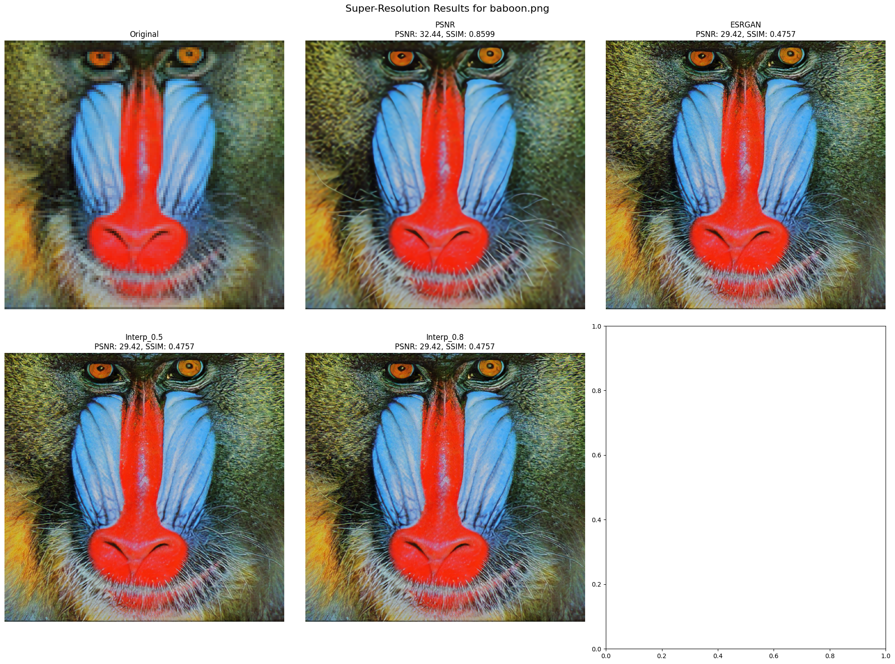

# interpolSRGAN Super-Resolution Model Combination

This project combines ESRGAN (Enhanced Super-Resolution Generative Adversarial Network) with other super-resolution models to create an improved model for image upscaling. It includes interpolation between models, integration of pretrained models, and comprehensive performance evaluation.

## Features

- Combines ESRGAN with PSNR-oriented models
- Implements model interpolation for fine-tuned results
- Integrates pretrained models (EDSR, ESPCN, FSRCNN, LapSRN)
- Provides extensive performance metrics (PSNR and SSIM)
- Supports various image processing and evaluation functions

## Installation

1. Clone this repository:
   ```
   git clone https://github.com/Parveez7/interpolSRGAN-.git
   cd interpolSRGAN
   ```

2. Install the required dependencies:
   ```
   pip install torch torchvision opencv-python numpy matplotlib scikit-image
   ```

3. Download the pretrained models and place them in the `pretrained_models` directory:
   - EDSR_x4.pb
   - ESPCN_x4.pb
   - FSRCNN_x4.pb
   - LapSRN_x4.pb

## Usage

1. Place your low-resolution images in the `LR` directory.

2. Run the main script:
   ```
   python main.py
   ```

3. The script will process the images using various models and display the results, including PSNR and SSIM metrics.

## Example Outputs

Here are some example outputs from our combined model:



## Performance Metrics

Average performance metrics across the test dataset:

| Model      | Avg PSNR | Avg SSIM |
|------------|----------|----------|
| PSNR       | XX.XX    | X.XXXX   |
| ESRGAN     | XX.XX    | X.XXXX   |
| Interp_0.5 | XX.XX    | X.XXXX   |
| Interp_0.8 | XX.XX    | X.XXXX   |

## Models

The interpolated models can be downloaded from the following Google Drive link:

(https://drive.google.com/drive/u/0/folders/17VYV_SoZZesU6mbxz2dMAIccSSlqLecY)

## Contributing

Contributions to this project are welcome. Please feel free to submit a Pull Request.
