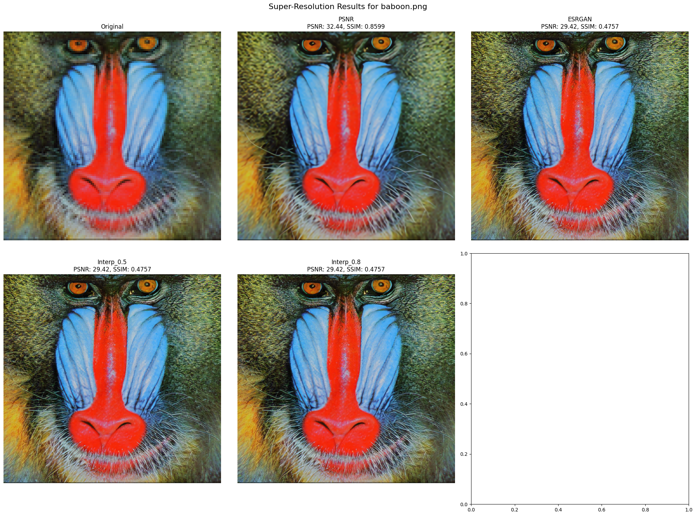

# ESRGAN Model Interpolation for Image Super-Resolution

This project presents a novel approach to image super-resolution through interpolated SRGAN models, offering a flexible solution for balancing pixel accuracy and perceptual quality in image upscaling tasks.

## 📑 Abstract

This research introduces a comprehensive study on Super-Resolution Generative Adversarial Networks (SRGAN) for image upscaling, with a novel focus on interpolated models. We implement and evaluate several SRGAN models, including the PSNR-oriented model, ESRGAN, and two interpolated models with α values of 0.5 and 0.8. Our study demonstrates that while PSNR-oriented models achieve higher pixel-wise accuracy and ESRGAN models produce better perceptual quality, interpolated models offer a flexible middle ground, providing practical solutions for various application domains.

## 🌟 Key Features

- Novel interpolation technique between PSNR and ESRGAN architectures
- Flexible α parameter control (implemented for 0.5 and 0.8)
- Comprehensive evaluation using PSNR and SSIM metrics
- Batch processing capability
- Real-time visualization of results

## 📊 Research Findings

Our experimental results show distinct characteristics for each model type:

| Model Type | Characteristics | Best Use Case |
|------------|----------------|---------------|
| PSNR-oriented | Highest pixel-wise accuracy, smoother textures | Medical imaging, scientific visualization |
| ESRGAN | Superior perceptual quality, better detail preservation | Entertainment, artistic applications |
| Interpolated (α=0.5) | Balanced performance, reduced artifacts | General-purpose upscaling |
| Interpolated (α=0.8) | Enhanced perceptual quality while maintaining accuracy | Photography, professional media |

## 📋 Requirements

```
torch
numpy
opencv-python
matplotlib
scikit-image
```

## 💻 Installation

1. Clone the repository:
```bash
git clone https://github.com/yourusername/esrgan-interpolation.git
cd esrgan-interpolation
```

2. Install the required packages:
```bash
pip install -r requirements.txt
```

3. Download the pre-trained models and place them in the `models` directory:
- RRDB_PSNR_x4.pth
- RRDB_ESRGAN_x4.pth

## 🚀 Usage

1. Place your low-resolution images in the `LR` directory
2. Run the Jupyter Notebook - ISRGAN.ipynb
3. The results will be saved in the main directory

## 📊 Sample Results

Here are some example results showing the interpolation effects:

### Example : Baboon Image

*Left to right: Original, PSNR, ESRGAN, Interpolated (0.5), (0.8)*

## 📈 Comparative Analysis

Detailed performance metrics from our research:

| Model | PSNR (dB) | SSIM | Key Characteristics |
|-------|-----------|------|---------------------|
| PSNR-oriented | ~30 | ~0.89 | Higher pixel accuracy, smoother textures |
| ESRGAN | ~27 | ~0.85 | Better perceptual quality, enhanced details |
| Interpolated (0.5) | ~28.5 | ~0.87 | Balanced performance |
| Interpolated (0.8) | ~27.5 | ~0.86 | Enhanced perception with accuracy |

## 🔧 Technical Implementation

### Model Architecture
The project implements the RRDB (Residual-in-Residual Dense Block) architecture with:
- 23 RRDB blocks
- 64 base features
- 32 growth channels
- 4x upscaling factor

### Interpolation Technique
Our novel interpolation approach combines model weights using:
```python
net_interp = (1 - α) * net_PSNR + α * net_ESRGAN
```
where α controls the balance between PSNR and ESRGAN characteristics.

## 🎯 Applications

Our research findings suggest optimal use cases for different models:

1. **Medical Imaging**: PSNR-oriented model for accurate detail preservation
2. **Entertainment Media**: ESRGAN for enhanced visual quality
3. **Professional Photography**: Interpolated models (α=0.5-0.8) for balanced results
4. **Scientific Visualization**: PSNR-oriented or low-α interpolated models

## 📝 Citation

If you use this code or findings in your research, please cite:

```
@InProceedings{wang2018esrgan,
    author = {Wang, Xintao and Yu, Ke and Wu, Shixiang and Gu, Jinjin and Liu, Yihao and Dong, Chao and Qiao, Yu and Loy, Chen Change},
    title = {ESRGAN: Enhanced Super-Resolution Generative Adversarial Networks},
    booktitle = {The European Conference on Computer Vision Workshops (ECCVW)},
    month = {September},
    year = {2018}
}
```

## 📄 License

This project is licensed under the MIT License 

## 🤝 Contributing

Contributions are welcome! Please feel free to submit a Pull Request.

1. Fork the repository
2. Create your feature branch (`git checkout -b feature/AmazingFeature`)
3. Commit your changes (`git commit -m 'Add some AmazingFeature'`)
4. Push to the branch (`git push origin feature/AmazingFeature`)
5. Open a Pull Request


## 🙏 Acknowledgments

This research builds upon the foundational work of Wang et al. in ESRGAN while introducing novel interpolation techniques. We thank the computer vision community for their continued contributions to the field of super-resolution.
